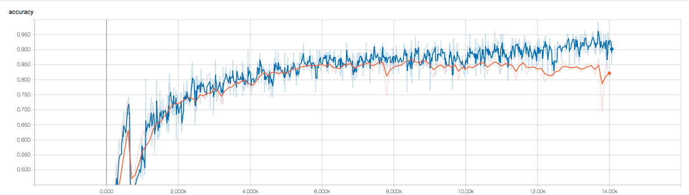
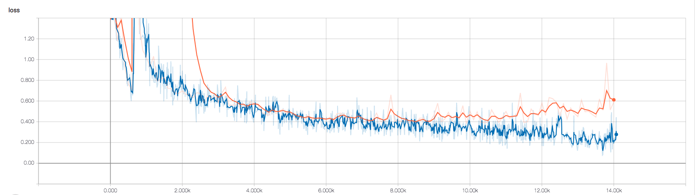

# Character-level CNN Text Classification

This model referenced the paper [Character-level Convolutional Networks for Text Classification](https://papers.nips.cc/paper/5782-character-level-convolutional-networks-for-text-classification.pdf)


## Instructions:
Run following commands:

```bash
$ python train.py
```

If you'd like to customize the parameters, edit lines in `train.py`.

## Results:




## Discussions:
I use the public dataset [AG's corpus of news articles](https://www.di.unipi.it/~gulli/AG_corpus_of_news_articles.html) and the performance of the model can be viewed wrt images above.